# Exercise 2 - Setting up the backlog with Copilot agent mode and GitHub's MCP Server

| [← Previous lesson: GitHub Copilot coding agent][previous-lesson] | [Next lesson: Custom instructions →][next-lesson] |
|:--|--:|

There's more to writing code than just writing code. Issues need to be filed, external services need to be called, and information needs to be gathered. Typically this involves interacting with external tools, which can break a developer's flow. Through the power of Model Context Protocol (MCP), you can access all of this functionality right from Copilot!

## Scenario

You are a part-time developer for Tailspin Toys - a crowdfunding platform for board games with a developer theme. You've been assigned various tasks to introduce new functionality to the website. Being a good team member, you want to file issues to track your work. To help future you, you've decided to enlist the help of Copilot. You will set up your backlog of work for the rest of the lab, using GitHub Copilot Chat agent mode and the GitHub Model Context Protocol (MCP) server to create the issues for you. 

To achieve this, you will:

- use Model Context Protocol (MCP), which provides access to external tools and capabilities.
- set up the GitHub MCP server in your repository.
- use GitHub Copilot Chat agent mode to create issues in your repository.

By the end of this exercise, you will have created a backlog of GitHub issues for use throughout the remainder of the lab.

## What is agent mode and Model Context Protocol (MCP)?

Agent mode in GitHub Copilot Chat transforms Copilot into an AI agent that can perform actions on your behalf. This mode allows you to interact with Copilot in a more dynamic way, enabling it to use tools and execute tasks, like running tests or terminal commands, reading problems from the editor, and using those insights to update your code. This allows for a more interactive and collaborative workflow, enabling you to leverage the capabilities of AI in your development process.

[Model Context Protocol (MCP)][mcp-blog-post] provides AI agents with a way to communicate with external tools and services. By using MCP, AI agents can communicate with external tools and services in real-time. This allows them to access up-to-date information (using resources) and perform actions on your behalf (using tools).

These tools and resources are accessed through an MCP server, which acts as a bridge between the AI agent and the external tools and services. The MCP server is responsible for managing the communication between the AI agent and the external tools (such as existing APIs or local tools like NPM packages). Each MCP server represents a different set of tools and resources that the AI agent can access.

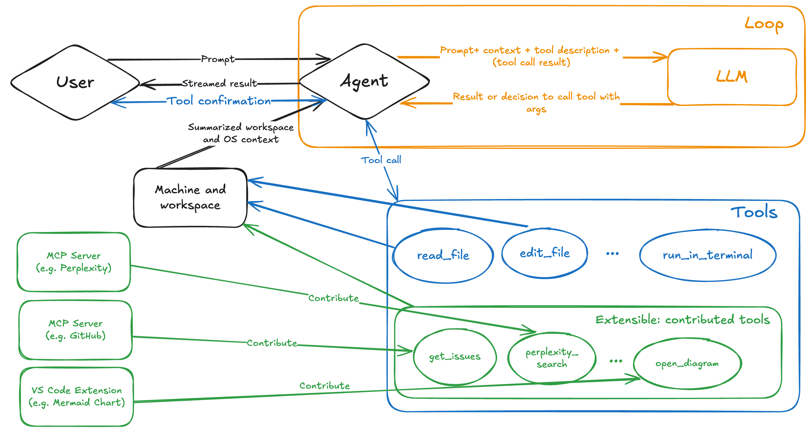

Popular existing MCP servers include:

- **[GitHub MCP Server][github-mcp-server]**: This server provides access to a set of APIs for managing your GitHub repositories. It allows the AI agent to perform actions such as creating new repositories, updating existing ones, and managing issues and pull requests.
- **[Playwright MCP Server][playwright-mcp-server]**: This server provides browser automation capabilities using Playwright. It allows the AI agent to perform actions such as navigating to web pages, filling out forms, and clicking buttons.
- **Additional reference servers**: There are many other MCP servers available that provide access to different tools and resources. Anthropic has [a list of MCP servers][anthropic-mcp-servers], including reference, third-party, and community implementations. 

> [!IMPORTANT]
> **Security Best Practice**: Treat MCP servers as you would any other dependency in your project. Before using an MCP server:
> - **Review the source code** carefully, especially around data handling and authentication
> - **Verify the publisher** - prefer official and well-maintained repositories
> - **Consider the permissions** - understand what access the MCP server requires
> - **Check for updates** regularly and monitor security advisories
> - **Use OAuth when available** instead of Personal Access Tokens (PATs) for better security
> - **Audit server actions** - review what actions the MCP server can perform on your behalf
> Only use MCP servers that you trust and be cautious about granting access to sensitive resources or operations.

## Ensure your codespace is ready

In a [prior exercise][prereqs-lesson] you launched the codespace you'll use for the remainder of the coding exercises in this lab. Let's put the final touches on it before we begin using it.

The setup process for the codespace installed and setup many [VS Code extensions][vscode-extensions]. As with any software, updates may be needed. When your codespace is created we'll need to ensure everything is up-to-date.

1. Return to the tab where you started your codespace. If you closed the tab, return to your repository, select **Code** > **Codespaces** and then the name of the codespace.
2. Select **Extensions** on the workbench on the left side of your codespace.

    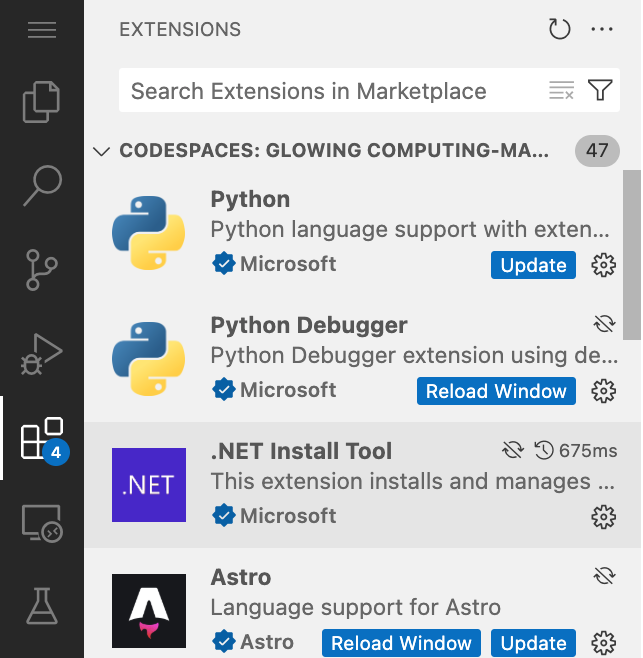

3. Select **Update** on any extensions with an **Update** button. Repeat as necessary.
4. Select **Reload Window** on any extensions with a **Reload Window** button to reload the codespace.
5. When prompted by a dialog, select **Reload** to reload the window. This will ensure the latest version is being used.

## Using GitHub Copilot Chat and agent mode

To access GitHub Copilot Chat agent mode, you need to have the GitHub Copilot Chat extension installed in your IDE, which should already be the case if you are using a GitHub Codespace.

> [!TIP]
> **When to Use Agent Mode**: Use agent mode when you need Copilot to:
> - Perform actions across multiple files or systems
> - Interact with external tools and services (via MCP)
> - Execute complex workflows that require multiple steps
> - Create or manage GitHub resources (issues, PRs, repositories)
> 
> For simple code completion or single-file edits, standard Copilot mode is often more efficient.

> [!TIP]
> If you do not have the GitHub Copilot Chat extension installed, you can [install it from the Visual Studio Code Marketplace][copilot-chat-extension]. Or open the Extensions view in Visual Studio Code, search for **GitHub Copilot Chat**, and select **Install**.

Once you have the extension installed, you may need to authenticate with your GitHub account to enable it.

1. Return to your codespace.
2. Select the **Copilot Chat** icon at the top of your codespace.
3. Type a message like "Hello world" in the Copilot Chat window and press enter. This should activate Copilot Chat.

    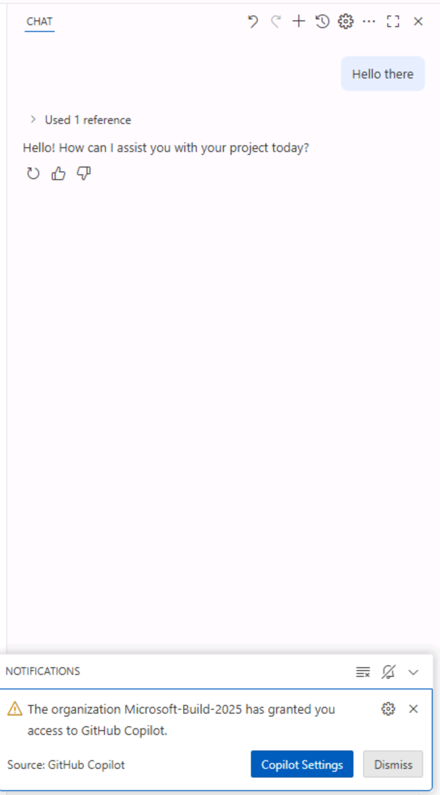

4. Alternatively, if you are not authenticated you will be prompted to sign in to your GitHub account. Follow the instructions to authenticate.

    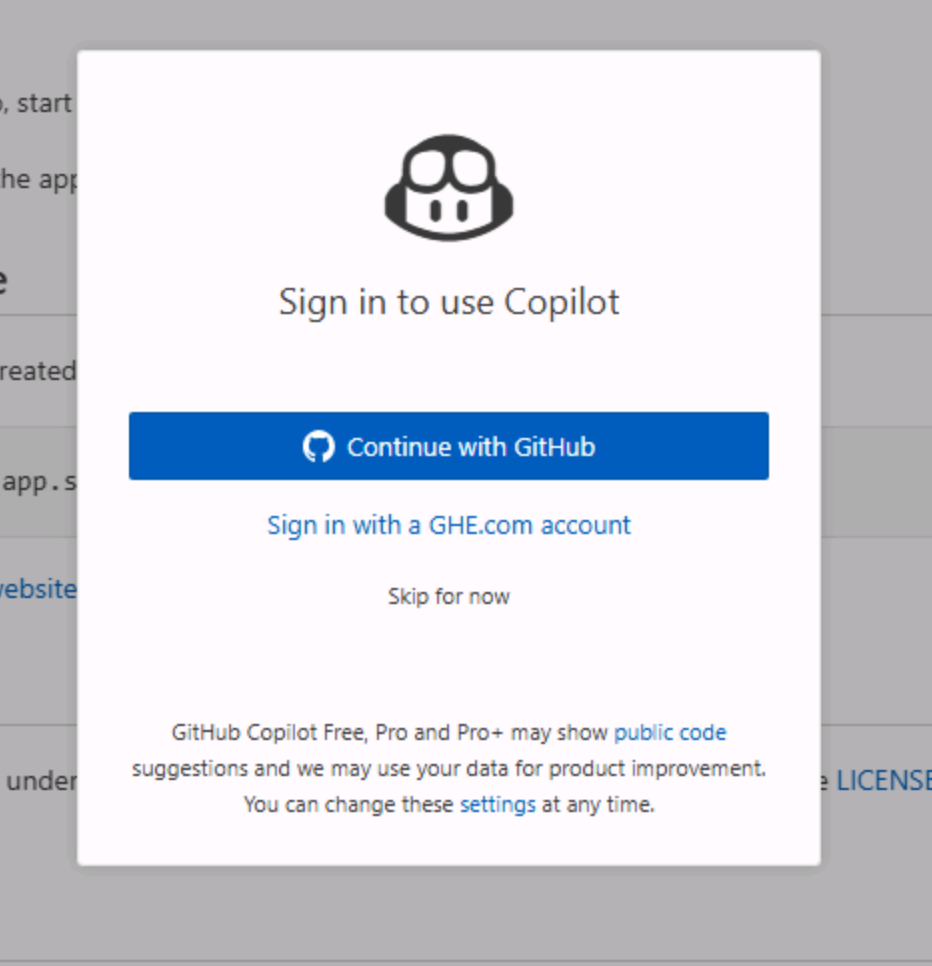

5. After authentication, you should see the Copilot Chat window appear.

    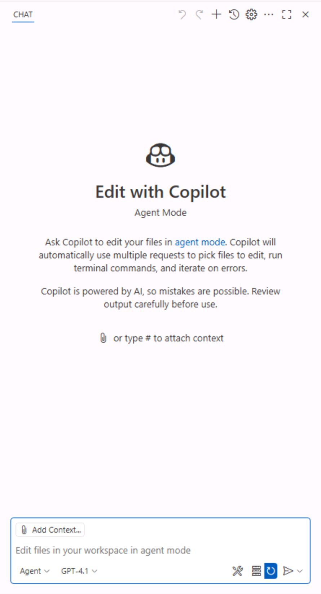

6. Switch to agent mode by selecting the dropdown in the Copilot Chat window and selecting **Agent**.

    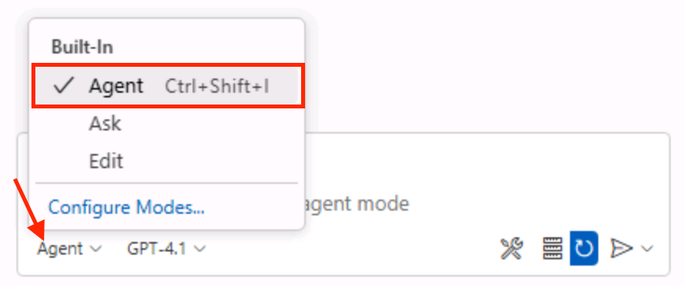

7. Set the model to **Claude 3.5 Sonnet**.

    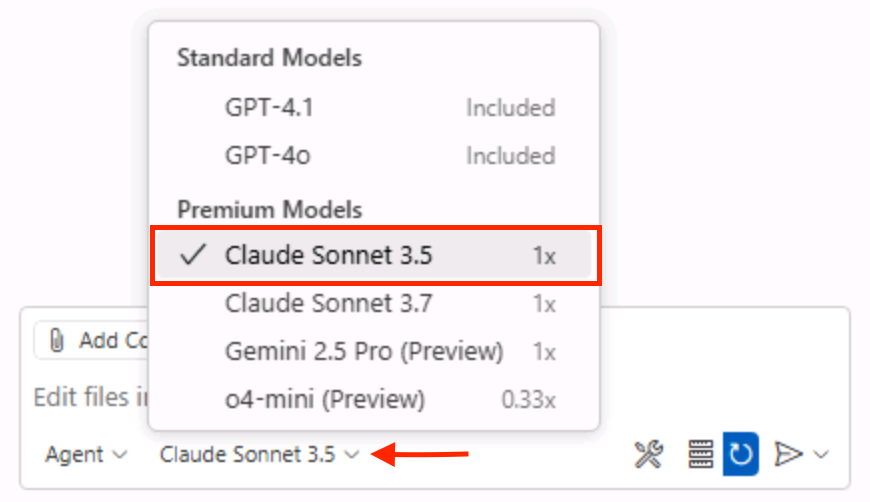

> [!IMPORTANT]
> **Model Selection Best Practice**: The authors of this lab are not indicating a preference towards one model or another. When building this lab, we used Claude 3.5 Sonnet, and as such are including that in the instructions. The hope is the code suggestions you receive will be relatively consistent to ensure a good experience. However, because LLMs are probabilistic, you may notice the suggestions received differ from what is indicated in the lab. This is perfectly normal and expected.
>
> **Tips for Model Selection**:
> - **Claude 3.5 Sonnet**: Excellent for complex reasoning, multi-step tasks, and detailed code generation
> - **GPT-4o**: Strong general-purpose model with good balance of speed and capability
> - **Experiment**: Try different models for different task types to find what works best for your workflow
> - **Cost awareness**: More capable models may have higher costs in production scenarios

8. The chat pane should update to indicate that you are now in agent mode. You should see a tools icon, showing that we can configure tools for GitHub Copilot to use.

    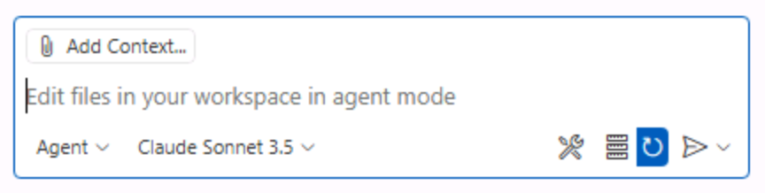

Typically, the number of tools available will be set to 0 when setting up a new project, as we have not configured any MCP servers yet. But to help you get started, we have created a **.vscode/mcp.json** file with an example configuration for the [GitHub MCP server][github-mcp-server]. Let's go and explore that next.

> [!TIP]
> **Verifying Tools Are Available**: After setting up an MCP server, you can verify it's working by:
> - Checking the tool count indicator in the Copilot Chat pane
> - Clicking the tools icon to see the full list of available tools
> - Testing with a simple command like "list issues in this repository"
> If tools aren't showing up, try restarting the MCP server or reloading the VS Code window.

## Setting up the GitHub MCP server

The **.vscode/mcp.json** file is used to configure the MCP servers that are available in this Visual Studio Code workspace. The MCP servers provide access to external tools and resources that GitHub Copilot can use to perform actions on your behalf.

1. Open **.vscode/mcp.json** file in your repository.
2. You should see a JSON structure similar to the following:

    ```json
    {
        "servers": {
            "github": {
            "type": "http",
            "url": "https://api.githubcopilot.com/mcp/"
            }
        }
    }
    ```

This configuration provides GitHub Copilot access to several additional tools so that it can interact with GitHub repositories, issues, pull requests, and more. This particular configuration uses the [remote GitHub MCP server][remote-github-mcp-server]. By using this approach, we don't need to worry about running the MCP server locally (and the associated management, like keeping it up to date), and we can authenticate to the remote server using OAuth 2.0 instead of a personal access token (PAT).

> [!TIP]
> **MCP Configuration Best Practices**:
> - **Remote vs Local**: Use remote MCP servers when available for easier maintenance and OAuth authentication
> - **Version Control**: Include `mcp.json` in version control, but never commit sensitive credentials
> - **Documentation**: Comment your MCP configurations to explain which servers are used and why
> - **Multiple Servers**: You can configure multiple MCP servers simultaneously to access different capabilities

The MCP server configuration is defined in the **servers** section of the **mcp.json** file. Each MCP server is defined by a unique name (in this case, github) and its type (in this case, **http**). When using local MCP servers, the type may be **stdio** and have a **command** and **args** field to specify how to start the MCP server. You can find out more about the configuration format in the [VS Code documentation][vscode-mcp-config]. In some configurations (not for the remote GitHub MCP server with OAuth), you may also see an **inputs** section. This defines any inputs (like sensitive tokens) that the MCP server may require. You can read more about the configuration properties in the [VS Code documentation][vscode-mcp-config]

To utilize an MCP server it needs to be "started". This will allow GitHub Copilot to communicate with the server and perform the tasks you request.

1. Inside VS Code, open **.vscode/mcp.json**.
2. To start the GitHub MCP server, select **Start** above the GitHub server.

    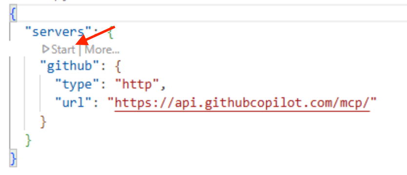

3. You should see a popup asking you to authenticate to GitHub.

    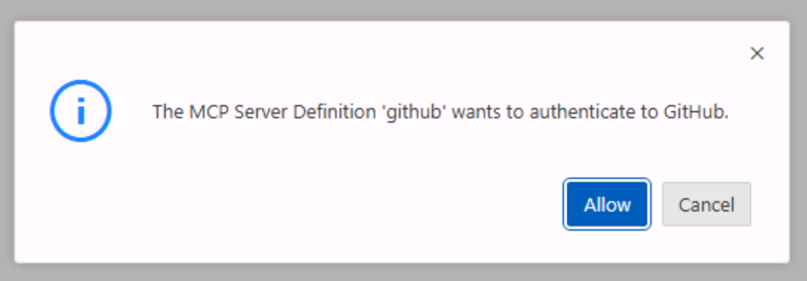

4. Select **Continue** on the user account that you're using for this lab.

    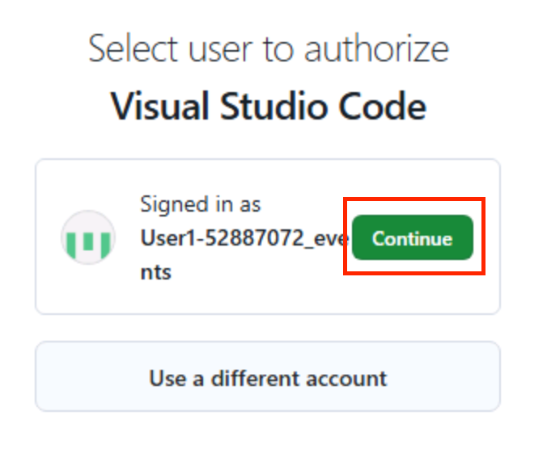

5. If the page appears, select **Authorize visual-studio-code** to allow the GitHub MCP server to login as your selected user account. Once complete, the page should say "You can now close the window.".

    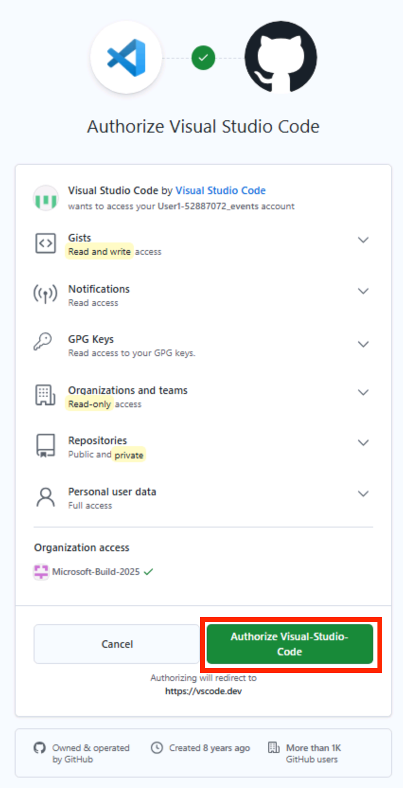

6. After navigating back to the GitHub Codespace, you should see that the GitHub MCP server has started. You can check this in two places:
    - The line in **.vscode/mcp.json** which previously said start. It should now present several options, and show a number of tools available. 
    - Select the tools icon in the Copilot Chat pane to see the tools available. Scroll down the list that appears at the top of the screen, and you should see a list of tools from the GitHub MCP server.

    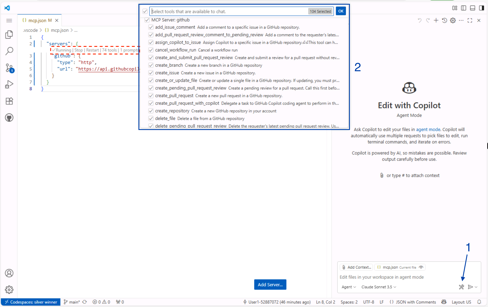

That's it! You can now use Copilot Chat in agent mode to create issues, manage pull requests, and more.

> [!IMPORTANT]
> **PAT Security Best Practices**: If you have any issues with this MCP server configuration, there are alternate configuration options in the [GitHub MCP server][github-mcp-server] repository using local or remote MCP. If you opt for a configuration that requires authentication via a GitHub Personal Access Token (PAT):
> - **Never share your PAT** - treat it like a password
> - **Use minimal scope** - only grant the permissions absolutely required
> - **Set expiration dates** - use short-lived tokens when possible
> - **Use environment variables** - never hardcode tokens in `mcp.json`
> - **Use the inputs property** - leverage VS Code's secure input mechanism for tokens
> - **Rotate regularly** - change tokens periodically as a security measure
> - **Revoke unused tokens** - clean up tokens that are no longer needed
> 
> Published tokens are one of the leading causes of security breaches. Always use OAuth when available.

## Creating a backlog of tasks

Now that you have set up the GitHub MCP server, you can use Copilot Agent mode to create a backlog of tasks for use in the rest of the lab.

> [!TIP]
> **Backlog Management Best Practices**:
> - **Be specific**: Provide clear, detailed prompts to get better issue descriptions
> - **Include context**: Reference your project's domain and requirements in prompts
> - **Use templates**: Establish a consistent format for issues (title, description, acceptance criteria)
> - **Review before creating**: Always review AI-generated content before confirming actions
> - **Iterate**: If the first result isn't perfect, refine your prompt and try again
> - **Batch operations**: Create multiple related issues in one session for efficiency

1. Return to the Copilot Chat pane. Select **Agent** from the dropdown list. Set the model to **Claude 3.5 Sonnet**.

    

2. Type or paste the following prompt to create the issues we'll be working on in the lab, replacing **<YOUR_REPOSITORY_PATH>** with the organization/name of your repository:

    ```markdown
    In <YOUR_REPOSITORY_PATH>, create GitHub issues for our Tailspin Toys backlog in the repo. Each issue should include:
    - A clear title
    - A brief description of the task and why it is important to the project
    - A checkbox list of acceptance criteria

    From our recent planning meeting, the upcoming backlog includes the following tasks:

    1. Allow users to filter games by category and publisher
    2. Update our repository coding standards (including rules about Python formatting and docstrings) in a custom instructions file
    3. Stretch Goal: Implement pagination on the game list page
    ```

3. Press <kbd>enter</kbd> or select the **Send** button to send the prompt to Copilot.
4. GitHub Copilot should process the request and respond with a dialog box asking you to confirm the creation of the issues.

    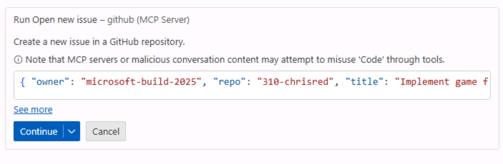

> [!IMPORTANT]
> **AI Review Best Practice**: AI can make mistakes, so always review generated content before confirming. Check for:
> - **Accuracy**: Does the content match your intent?
> - **Completeness**: Are all required fields populated?
> - **Clarity**: Is the description clear and actionable?
> - **Security**: Does the content avoid exposing sensitive information?
> - **Formatting**: Is the markdown properly formatted?
> 
> Taking a moment to review saves time fixing issues later.

5. Select **see more** in **Run open new issue** box to see the details of the issue that will be created.
6. Ensure the details in the **owner** and **repo**, **title** and **body** of the issue look correct. You can make any desired edits by double clicking the body and updating the content with the correct information.
7. After reviewing the generated content, select **Continue** to create the issue.

    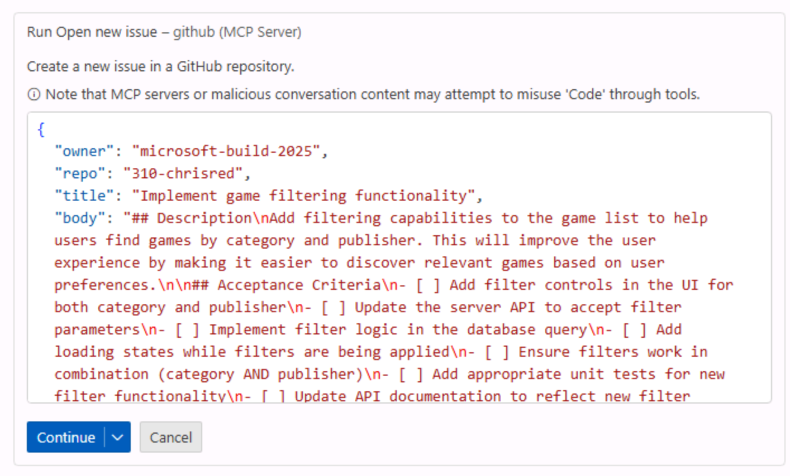

8. Repeat steps 4-6 for the remainder of the issues. Alternatively, if you are comfortable with Copilot automatically creating the issues you can select the down-arrow next to **Continue** and select **Allow in this session** to allow Copilot to create the issues for this session (the current chat).

    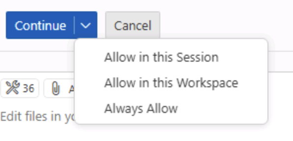

> [!IMPORTANT]
> **Permission Best Practice**: Ensure you are comfortable with Copilot automatically performing tasks on your behalf before selecting **Allow in this session** or similar options. Consider:
> - **Start conservatively**: Review each action individually when learning or working with sensitive data
> - **Session scope**: "Allow in this session" limits permissions to the current chat, reducing risk
> - **Permanent permissions**: Be very cautious about granting permanent "always allow" permissions
> - **Revoke when done**: Clear permissions when you're finished with a task or changing contexts
> - **Team policies**: Follow your organization's guidelines for AI tool usage and permissions

9. In a separate browser tab, navigate to your GitHub repository and select the issues tab.
10. You should see a list of issues that have been created by Copilot. Each issue should include a clear title and a checkbox list of acceptance criteria.

You should notice that the issues are fairly detailed. This is where we benefit from the power of Large Language Models (LLMs) and Model Context Protocol (MCP), as it has been able to create a clear initial issue description.

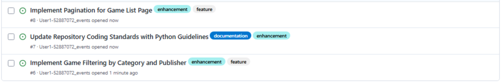

> [!TIP]
> **Post-Creation Workflow Tips**:
> - **Verify in GitHub**: Always check the created issues in GitHub to confirm they were created correctly
> - **Add labels**: Enhance issues with appropriate labels for better organization
> - **Assign owners**: Assign issues to team members as appropriate
> - **Set milestones**: Link issues to project milestones for better tracking
> - **Link dependencies**: Use GitHub's linking features to show relationships between issues
> - **Update as needed**: Don't hesitate to edit AI-generated issues to add details or corrections

## Summary and next steps

Congratulations, you have created issues on GitHub using Copilot Chat and MCP!

To recap, in this exercise we:

- used Model Context Protocol (MCP), which provides access to external tools and capabilities.
- set up the GitHub MCP server in your repository.
- used GitHub Copilot Chat agent mode to create issues in your repository.

With the GitHub MCP server configured, you can now use GitHub Copilot Chat Agent Mode to perform additional actions on your behalf, like creating new repositories, managing pull requests, and searching for information across your repositories.

You can now continue to the next exercise, where you will learn how to [provide Copilot guidance with custom instructions][next-lesson] to ensure code is generated following your organization's defined patterns and practices.

### Optional exploration exercise – Set up the Microsoft Playwright MCP server

If you are feeling adventurous, you can try installing and configuring another MCP server, such as the [Microsoft Playwright MCP server][playwright-mcp-server]. This will allow you to use GitHub Copilot Chat Agent Mode to perform browser automation tasks, such as navigating to web pages, filling out forms, and clicking buttons.

You can find the instructions for installing and configuring the Playwright MCP server in the [Playwright MCP repository][playwright-mcp-server].

Notice that the setup process is similar to the GitHub MCP server, but you do not need to provide any credentials like the GitHub Personal Access Token. This is because the Playwright MCP server does not require authentication to access its capabilities.

## Resources

- [What the heck is MCP and why is everyone talking about it?][mcp-blog-post]
- [GitHub MCP Server][github-mcp-server]
- [Microsoft Playwright MCP Server][playwright-mcp-server]
- [Anthropic MCP Servers][anthropic-mcp-servers]
- [VS Code Extensions][vscode-extensions]
- [GitHub Copilot Chat Extension][copilot-chat-extension]
- [Creating a fine-grained personal access token][github-pat-docs]

---

| [← Previous lesson: GitHub Copilot coding agent][previous-lesson] | [Next lesson: Custom instructions →][next-lesson] |
|:--|--:|

[previous-lesson]: ./1-copilot-coding-agent.md
[next-lesson]: ./3-custom-instructions.md
[prereqs-lesson]: ./0-prereqs.md
[mcp-blog-post]: https://github.blog/ai-and-ml/llms/what-the-heck-is-mcp-and-why-is-everyone-talking-about-it/
[github-mcp-server]: https://github.com/github/github-mcp-server
[playwright-mcp-server]: https://github.com/microsoft/playwright-mcp
[anthropic-mcp-servers]: https://github.com/modelcontextprotocol/servers
[vscode-extensions]: https://code.visualstudio.com/docs/configure/extensions/extension-marketplace
[copilot-chat-extension]: https://marketplace.visualstudio.com/items?itemName=GitHub.copilot
[github-pat-docs]: https://docs.github.com/en/authentication/keeping-your-account-and-data-secure/managing-your-personal-access-tokens#creating-a-fine-grained-personal-access-token
[remote-github-mcp-server]: https://github.blog/changelog/2025-06-12-remote-github-mcp-server-is-now-available-in-public-preview/
[vscode-mcp-config]: https://code.visualstudio.com/docs/copilot/chat/mcp-servers#_configuration-format