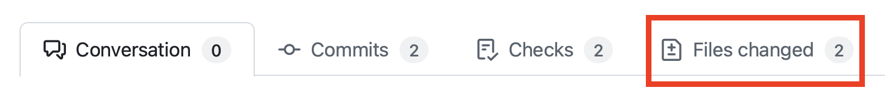
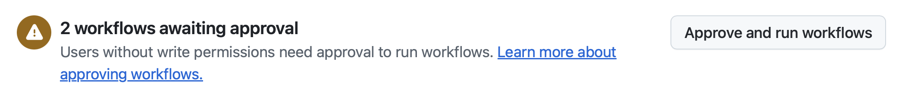

# Exercise 5: Reviewing GitHub Copilot Coding Agent's Work

| [← Previous: Adding New Functionality with Copilot Agent Mode][previous-lesson] |
|:----:|

## Introduction

Earlier in this lab, you assigned issues to the GitHub Copilot coding agent—such as adding documentation and developing new API endpoints for team collaboration. In this exercise, you'll review Copilot's code changes, provide feedback, and iterate to improve the results. This mirrors real-world DevOps and collaborative coding practices, even when using generative AI.

---

## Scenario

Generative AI accelerates development, but **human review remains essential**. Code reviews, testing, and approval are still core practices. In this exercise, you'll review Copilot's pull requests (PRs), provide feedback, and iterate, ensuring quality and security before sharing changes with your team.

---

## Security & Copilot Coding Agent

Copilot coding agent works asynchronously and under strict security controls to protect your repository:

- Read-only access to your repository except for the branch Copilot uses for its code.
- Runs within a dedicated, ephemeral GitHub Actions environment.
- All GitHub Actions workflows require human approval.
- [Access to external resources is restricted by default][agent-firewall], including MCP servers.

---

## Step 1: Review Copilot's Generated Documentation

Start by examining Copilot’s PR for documentation updates:

> **Note:**  
> You may see a firewall warning in the PR. This is expected—Copilot is restricted from accessing external resources by default. You can [customize or disable the firewall][agent-firewall] if needed.

1. Navigate to your repository on GitHub.com.
2. Click **Pull Requests** to view open PRs.
3. Open the PR titled **Add missing documentation** or similar.
    - If the PR is marked **[WIP]**, Copilot is still working. Wait for completion and use this time to review previous lessons.

4. Click **Files changed** to inspect the documentation Copilot added.

    

5. Read through the new docstrings and comments.
6. Return to the **Conversation** tab.
7. If workflows are pending, click **Approve and run workflows**.

    

8. Workflows will run for both backend and frontend—wait for all checks to complete.

---

## Step 2: Request Changes from Copilot

You can collaborate with Copilot by leaving comments in the PR, just as you would with a human teammate. Copilot will start a new session and address your feedback. Here are examples of requests you might make:

- Add header comments describing each file’s purpose.
- Add docstrings to TypeScript or Svelte files.
- Create README files in the server and client folders.

**How to request changes:**

1. Add a PR comment with your suggestion.
2. Click **View Session** to watch Copilot respond in real-time.
3. When Copilot completes the update, a new commit appears in the PR.
4. Review the new changes under **Files changed**.
5. Iterate until satisfied. When ready, mark the PR as "Ready for review" and merge it.

    

---

## Step 3: Review Copilot's New API Endpoints

Next, review Copilot’s PR for adding CRUD endpoints to the games API:

1. Go to **Pull Requests** in your repository.
2. Open the PR titled **Add CRUD endpoints for games API** or similar.
3. Review the updates under **Files changed**.
4. Return to the **Conversation** tab and approve any pending workflows.

    

5. Wait for workflow checks to pass.
6. *(Optional)* Test the new endpoints manually:
    - Switch to the Copilot-created branch in your Codespace:

    ```bash
    git fetch origin
    git checkout <branch-name>
    ```
    - Replace `<branch-name>` with the Copilot branch name (e.g., `copilot/fix-8`).

7. To further improve the endpoints, comment in the PR (e.g., request centralized error handling or more docstrings). Copilot will respond with another session and commit.

---

## Optional Exercise: Assign More Issues to Copilot

Explore Copilot's capabilities by creating additional issues for it to solve. Ideas:

- Add a backer interest form to the game details page.
- Implement pagination for the game listing endpoint.
- Add input validation and error handling to the Flask API.
- Or invent your own enhancements!

---

## Summary

Congratulations—lab complete! You have:

- **Streamlined development** with GitHub Copilot and Model Context Protocol (MCP).
- **Enforced coding standards** with custom instructions and prompt files.
- **Automated and coordinated changes** across backend and frontend using Copilot Agent Mode.
- **Collaborated interactively**—assigning issues, reviewing PRs, and providing feedback for iterative improvements.

This is just the beginning. Keep exploring how Copilot can supercharge your projects. Happy coding!

---

## Resources

- [GitHub Copilot][github-copilot]
- [About Copilot agents][copilot-agents]
- [Assigning GitHub issues to Copilot][assign-issue]
- [Copilot coding agent setup workflow best practices][coding-agent-best-practices]
- [Configuring Copilot coding agent firewall][agent-firewall]

---

| [← Previous: Adding New Functionality with Copilot Agent Mode][previous-lesson] |
|:----:|

[github-copilot]: https://github.com/features/copilot
[coding-agent-overview]: https://docs.github.com/en/copilot/using-github-copilot/coding-agent/about-assigning-tasks-to-copilot#overview-of-copilot-coding-agent
[assign-issue]: https://docs.github.com/en/copilot/using-github-copilot/coding-agent/using-copilot-to-work-on-an-issue
[setup-workflow]: https://docs.github.com/en/copilot/using-github-copilot/coding-agent/best-practices-for-using-copilot-to-work-on-tasks#pre-installing-dependencies-in-github-copilots-environment
[copilot-agents]: https://docs.github.com/en/copilot/using-github-copilot/coding-agent/about-assigning-tasks-to-copilot
[coding-agent-best-practices]: https://docs.github.com/en/copilot/using-github-copilot/coding-agent/best-practices-for-using-copilot-to-work-on-tasks
[agent-firewall]: https://docs.github.com/en/copilot/customizing-copilot/customizing-or-disabling-the-firewall-for-copilot-coding-agent

[previous-lesson]: ./4-copilot-agent-mode-vscode.md
