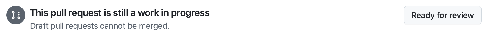

# Exercise 5: Review GitHub Copilot Coding Agent's Work

| [← Previous: Adding New Functionality with Copilot Agent Mode][previous-lesson] |
|:----:|

## Overview

In this exercise, you'll review the work that GitHub Copilot coding agent has performed on your project. Earlier in the lab, you assigned issues to Copilot—such as adding documentation and implementing new API endpoints. Now, it's time to examine Copilot's code changes, provide feedback, and iterate to ensure quality and alignment with your team's standards.

## Scenario

While generative AI tools like Copilot can accelerate development, **core software design and DevOps fundamentals remain unchanged**. Human review is essential for ensuring quality, security, and maintainability. In this exercise, you'll follow standard DevOps practices to review Copilot's pull requests (PRs) and provide actionable feedback.

## Security Considerations with Copilot Coding Agent

Copilot coding agent operates asynchronously and under strict security constraints to protect your repository:

- **Read access**: Copilot can read your repository.
- **Limited write access**: Copilot can write **only** to its designated branch.
- **Isolated environment**: The coding agent runs inside GitHub Actions, creating a separate, ephemeral workspace.
- **Human approval required**: All GitHub Actions workflows initiated by Copilot require manual approval before running.
- **Firewall restrictions**: [Copilot's access to external resources is limited by default][agent-firewall], including MCP servers.

## Step 1: Review Generated Documentation

Start by inspecting Copilot's pull request for documentation updates:

> **Note:**  
> You may see a firewall warning in the PR about GitHub Copilot being blocked from external resources. This is **expected behavior**. To adjust firewall settings, refer to [customizing or disabling the firewall][agent-firewall].

1. Go to your repository on GitHub.com.
2. Click **Pull Requests** to view open PRs.
3. Locate the PR titled **Add missing documentation** (or similar).
    - If the PR is still in progress, the issue will display a **[WIP]** flag. Wait for Copilot to finish; this may take a few minutes.
4. Open the PR and select **Files changed** to review the documentation updates.

    

5. Read through the new docstrings and comments added by Copilot.
6. Return to the **Conversation** tab.
7. If workflows are pending, click **Approve and run workflows**.

    

8. Workflow checks will appear and run for both backend and frontend. Wait for all checks to complete.

## Step 2: Request Changes from Copilot

Collaboration with Copilot is interactive. Provide feedback directly within the PR:

- Suggest improvements, such as:
  - Adding header comments to code files.
  - Extending docstrings to TypeScript or Svelte files.
  - Creating README files for server and client directories.

1. Add your suggestion as a comment in the PR.
2. Click **View Session** to watch Copilot process your feedback in real-time.
3. When Copilot completes the updates, a new commit will be added to the PR.
4. Review the changes under **Files changed**.
5. Repeat as needed until you're satisfied. When ready, mark the PR as "Ready for review" and merge.

    

## Step 3: Review New API Endpoints

Next, examine Copilot's work on adding CRUD endpoints to the games API:

1. In your repository, go to **Pull Requests**.
2. Find the PR titled **Add CRUD endpoints for games API** (or similar).
3. Review updates under **Files changed**.
4. Return to the **Conversation** tab and approve any pending workflows.

    

5. Wait for workflow checks to pass.
6. *(Optional)* Switch to the Copilot-created branch in your Codespace to manually test the new endpoints:

    ```bash
    git fetch origin
    git checkout <branch-name>
    ```

7. As before, you can request further improvements—such as centralized error handling, or more comments—by commenting in the PR.

## Optional Challenge: Assign More Issues to Copilot

Experiment further by creating additional issues for Copilot to solve. Example ideas:

- Add a backer interest form to the game details page.
- Implement pagination for the game listing endpoint.
- Add input validation and error handling to the Flask API.
- Or invent your own enhancements!

## Summary

Congratulations—you've completed the lab! You have:

- **Leveraged GitHub Copilot and Model Context Protocol (MCP)** to streamline development.
- **Used custom instructions and prompt files** to enforce coding standards and automate repetitive tasks.
- **Collaborated with Copilot Agent Mode** to implement features across your codebase.
- **Experienced interactive, iterative development** by reviewing and refining Copilot's pull requests.

This is just the beginning. We hope you continue exploring Copilot's potential to supercharge your projects. Happy coding!

## Resources

- [GitHub Copilot][github-copilot]
- [About Copilot agents][copilot-agents]
- [Assigning GitHub issues to Copilot][assign-issue]
- [Copilot coding agent setup workflow best practices][coding-agent-best-practices]
- [Configuring Copilot coding agent firewall][agent-firewall]

---

| [← Previous: Adding New Functionality with Copilot Agent Mode][previous-lesson] |
|:----:|

[github-copilot]: https://github.com/features/copilot
[coding-agent-overview]: https://docs.github.com/en/copilot/using-github-copilot/coding-agent/about-assigning-tasks-to-copilot#overview-of-copilot-coding-agent
[assign-issue]: https://docs.github.com/en/copilot/using-github-copilot/coding-agent/using-copilot-to-work-on-an-issue
[setup-workflow]: https://docs.github.com/en/copilot/using-github-copilot/coding-agent/best-practices-for-using-copilot-to-work-on-tasks#pre-installing-dependencies-in-github-copilots-environment
[copilot-agents]: https://docs.github.com/en/copilot/using-github-copilot/coding-agent/about-assigning-tasks-to-copilot
[coding-agent-best-practices]: https://docs.github.com/en/copilot/using-github-copilot/coding-agent/best-practices-for-using-copilot-to-work-on-tasks
[agent-firewall]: https://docs.github.com/en/copilot/customizing-copilot/customizing-or-disabling-the-firewall-for-copilot-coding-agent

[previous-lesson]: ./4-copilot-agent-mode-vscode.md
